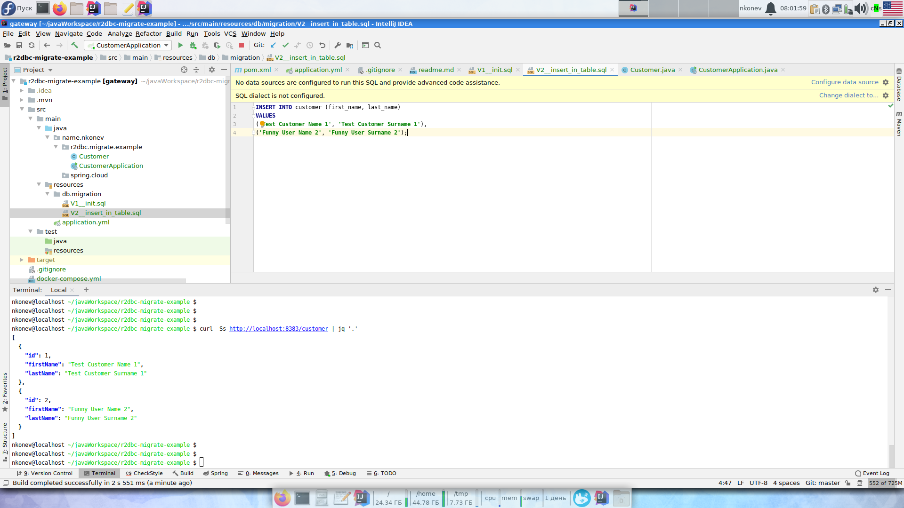

# Example of usage r2dbc-migrate

1. `docker-compose up -d`
2. Start CustomerApplication class in your IDE
3. `curl -v http://localhost:8383/customer`
4. Profit:

# Further steps
* See [video](https://www.youtube.com/watch?v=t7oLx9RJkB8&feature=youtu.be)
* [Video](https://www.youtube.com/watch?v=xCu73WVg8Ps) about proper invocation blocking methods from the reactive code
